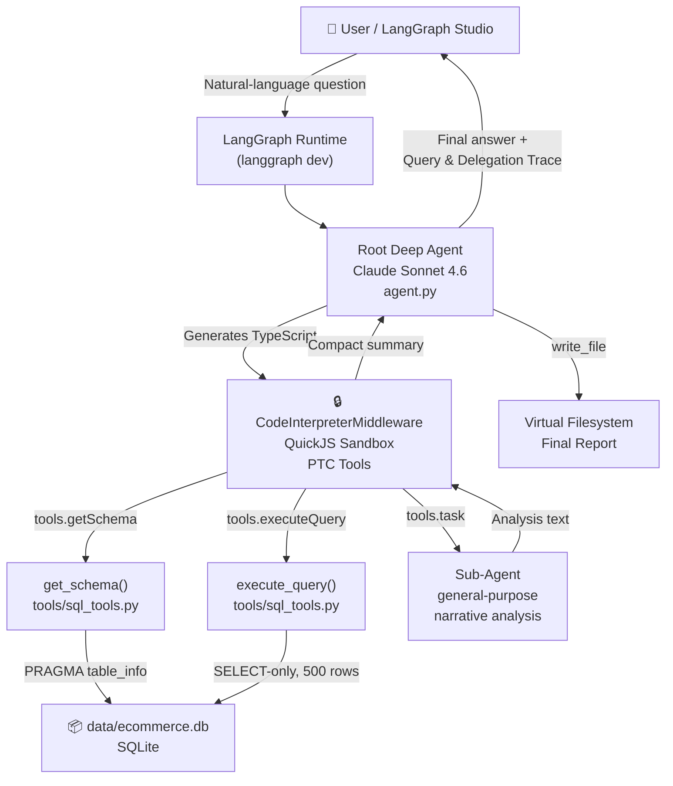
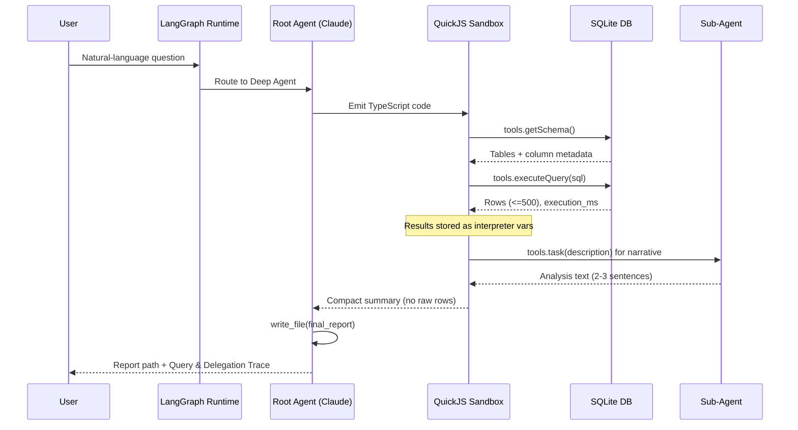

<div align="center">

<h1>🔍 SQL Analyst Agent</h1>

<p><strong>Interpreter-first, context-efficient SQL analytics powered by LangGraph, Deep Agents, and Claude.</strong></p>

<p>
  <a href="https://github.com/inamdarmihir/sql-analyst-agent/releases"></a>
  <a href="https://www.python.org/downloads/"></a>
  <a href="https://pypi.org/project/langgraph/"></a>
  <a href="https://pypi.org/project/deepagents/"></a>
  <a href="https://www.anthropic.com/"></a>
  <a href="LICENSE"></a>
  <a href="https://github.com/inamdarmihir/sql-analyst-agent/issues"></a>
  <a href="https://github.com/inamdarmihir/sql-analyst-agent/stargazers"></a>
</p>

<p>
  <a href="#-quick-start">Quick Start</a> ·
  <a href="#-architecture">Architecture</a> ·
  <a href="#-usage">Usage</a> ·
  <a href="#-example-questions">Examples</a> ·
  <a href="#-contributing">Contributing</a>
</p>

</div>

---

## Overview

**SQL Analyst Agent** is an interpreter-first [Deep Agents](https://github.com/langchain-ai/deepagents) implementation for natural-language SQL analytics on a seeded SQLite e-commerce dataset.

Traditional tool-calling agents pass every query result back through the LLM's context — burning tokens, risking hallucinated values, and hitting context limits on large datasets. This project takes a fundamentally different approach: the model writes **TypeScript inside a sandboxed QuickJS interpreter** that calls SQL tools programmatically via **Programmatic Tool Calling (PTC)**. Intermediate results live entirely in interpreter memory. Only compact, reasoned summaries — never raw rows — are returned to the LLM's context window.

Deeper narrative analysis is delegated to sub-agents via `tools.task`, also invoked from interpreter code. The root agent synthesizes everything into a structured final report.

---

## Table of Contents

- [Overview](#overview)
- [Features](#-features)
- [Architecture](#-architecture)
- [Tech Stack](#-tech-stack)
- [Compatibility Matrix](#-compatibility-matrix)
- [Installation](#-installation)
- [Quick Start](#-quick-start)
- [Project Structure](#-project-structure)
- [Configuration](#-configuration)
- [Environment Variables](#-environment-variables)
- [Usage](#-usage)
- [Dataset](#-dataset)
- [Example Questions](#-example-questions)
- [Extending the Agent](#-extending-the-agent)
- [Docker](#-docker)
- [Testing](#-testing)
- [Security](#-security)
- [Performance](#-performance)
- [FAQ](#-faq)
- [Troubleshooting](#-troubleshooting)
- [Roadmap](#-roadmap)
- [Changelog](#-changelog)
- [Contributing](#-contributing)
- [License](#-license)
- [Acknowledgements](#-acknowledgements)
- [Maintainers](#-maintainers)

---

## ✨ Features

| Feature | Description |
|---|---|
| **Interpreter-first execution** | The LLM writes TypeScript that runs inside a QuickJS sandbox — raw rows never enter the model's context. |
| **Programmatic Tool Calling (PTC)** | SQL tools are called from interpreter code, not directly by the root model, enabling loops, maps, and conditional logic. |
| **Context-efficient analytics** | Only aggregates, ratios, and short derived text return to the LLM — unbounded result sets stay safely in interpreter state. |
| **Sub-agent delegation** | Narrative analysis of result slices is farmed out to `general-purpose` sub-agents via `tools.task`, invoked from code. |
| **Read-only SQL safety guard** | `execute_query` enforces `SELECT`-only statements and strips all SQL comments before execution. |
| **500-row result cap** | Results are truncated at 500 rows with a `truncated: true` flag — forces aggregation-first thinking. |
| **Deterministic dataset** | Reproducible synthetic e-commerce SQLite DB seeded with `Faker` at `SEED=42`. |
| **LangGraph runtime** | Full LangGraph graph with `MemorySaver` checkpointing; served via `langgraph dev`. |
| **Swappable model provider** | One-line change to switch from Anthropic Claude to any LangChain-supported model. |
| **Structured final reports** | Every session produces a written report (via `write_file`) plus a Query and Delegation Trace. |

---

## 🏗 Architecture

### High-Level Architecture



### Request Flow



### Component Reference

```
┌─────────────────────────────────────────────────────────────────────┐
│                         LangGraph Runtime                           │
│  (langgraph dev — served via langgraph.json -> agent.py:agent)      │
└───────────────────────────────┬─────────────────────────────────────┘
                                 │
                                 ▼
                    ┌────────────────────────┐
                    │   Root Deep Agent       │  agent.py
                    │  (claude-sonnet-4-6)    │  create_deep_agent(...)
                    └───────────┬────────────┘
                                │ system prompt enforces:
                                │  1. call get_schema first
                                │  2. store results as interpreter vars
                                │  3. delegate narrative via tools.task
                                │  4. write final report with write_file
                                ▼
                ┌───────────────────────────────────┐
                │   CodeInterpreterMiddleware        │  (QuickJS sandbox)
                │   ptc = [execute_query,            │
                │          get_schema, task]         │
                │   max_ptc_calls=100, timeout=15s   │
                │   snapshot_between_turns=True      │
                └───────────────┬────────────────────┘
                                │ interpreter code calls PTC tools directly
                 ┌──────────────┼───────────────────┐
                 ▼              ▼                   ▼
        ┌────────────────┐ ┌────────────────┐ ┌──────────────────┐
        │ get_schema     │ │ execute_query  │ │ tools.task        │
        │ sql_tools.py   │ │ sql_tools.py   │ │ (sub-agent calls) │
        │ PRAGMA         │ │ SELECT-only,   │ │ for narrative      │
        │ table_info +   │ │ 500-row cap,   │ │ analysis of result │
        │ row counts     │ │ comment-strip  │ │ slices             │
        └───────┬────────┘ └───────┬────────┘ └──────────────────┘
                │                  │
                └────────┬─────────┘
                         ▼
              ┌────────────────────┐
              │ data/ecommerce.db  │  SQLite (generated by seed_data.py)
              └────────────────────┘
```

### Key Components

| Component | File | Responsibility |
|---|---|---|
| Agent definition & system prompt | `agent.py` | Wires model, tools, checkpointer, and `CodeInterpreterMiddleware`; defines operating rules. |
| SQL tools | `tools/sql_tools.py` | `execute_query` (SELECT-only, 500-row cap, comment stripping) and `get_schema` (PRAGMA introspection). |
| Tool exports | `tools/__init__.py` | Re-exports SQL tools for import by `agent.py`. |
| Dataset seeding | `seed_data.py` | Deterministically generates the synthetic SQLite database using `Faker(seed=42)`. |
| LangGraph entrypoint | `langgraph.json` | Declares the `agent` graph served by `langgraph dev`. |
| Environment template | `.env.example` | Placeholder for `ANTHROPIC_API_KEY`. |

---

## 🛠 Tech Stack

| Technology | Version | Role |
|---|---|---|
| [Python](https://www.python.org/) | >= 3.11 | Runtime language |
| [LangGraph](https://github.com/langchain-ai/langgraph) | >= 0.5.0 | Agent graph runtime + dev server |
| [Deep Agents](https://github.com/langchain-ai/deepagents) | >= 0.6.0 | Deep Agent harness + PTC framework |
| [langchain-quickjs](https://pypi.org/project/langchain-quickjs/) | via deepagents | QuickJS sandbox + `CodeInterpreterMiddleware` |
| [langchain-anthropic](https://pypi.org/project/langchain-anthropic/) | >= 0.3.0 | Anthropic model integration |
| [Anthropic Claude Sonnet 4.6](https://www.anthropic.com/) | `claude-sonnet-4-6` | Root agent LLM |
| [SQLite](https://www.sqlite.org/) | built-in | E-commerce dataset storage |
| [Faker](https://faker.readthedocs.io/) | >= 28.0.0 | Deterministic synthetic data generation |
| [langgraph-checkpoint-sqlite](https://pypi.org/project/langgraph-checkpoint-sqlite/) | latest | SQLite-backed conversation checkpointing |
| [uv](https://docs.astral.sh/uv/) | latest | Dependency management + script runner |
| [Hatchling](https://hatch.pypa.io/) | latest | Build backend |

---

## 📊 Compatibility Matrix

| Python | LangGraph | deepagents | langchain-anthropic | Status |
|:---:|:---:|:---:|:---:|:---:|
| 3.11 | >= 0.5.0 | >= 0.6.0 | >= 0.3.0 | ✅ Supported |
| 3.12 | >= 0.5.0 | >= 0.6.0 | >= 0.3.0 | ✅ Supported |
| 3.13 | >= 0.5.0 | >= 0.6.0 | >= 0.3.0 | ⚠️ Untested |
| < 3.11 | — | — | — | ❌ Not supported |

---

## 📦 Installation

### Prerequisites

- **Python 3.11+** — [Download](https://www.python.org/downloads/)
- **uv** — fast Python package and project manager

```bash
# Install uv (macOS / Linux)
curl -LsSf https://astral.sh/uv/install.sh | sh

# Or with pip
pip install uv
```

### Clone the repository

```bash
git clone https://github.com/inamdarmihir/sql-analyst-agent.git
cd sql-analyst-agent
```

### Install dependencies

```bash
uv sync
```

This installs all dependencies declared in `pyproject.toml` into an isolated virtual environment managed by `uv`.

---

## 🚀 Quick Start

```bash
# 1. Install dependencies
uv sync

# 2. Configure your API key
cp .env.example .env
# Edit .env and set: ANTHROPIC_API_KEY=sk-ant-...

# 3. Seed the SQLite dataset
uv run python seed_data.py

# 4. Launch the LangGraph dev server
langgraph dev
```

Open the **LangGraph Studio** URL printed in your terminal and ask a natural-language question such as:

> "Which product category has the highest return rate, and why?"

---

## 📁 Project Structure

```
sql-analyst-agent/
├── agent.py              # Deep Agent definition, system prompt, middleware wiring
├── data/
│   └── ecommerce.db      # SQLite database (generated by seed_data.py)
├── langgraph.json        # LangGraph app entrypoint config
├── pyproject.toml        # Project metadata and dependencies
├── seed_data.py          # Deterministic synthetic data generator (SEED=42)
├── tools/
│   ├── __init__.py       # Tool re-exports
│   └── sql_tools.py      # execute_query / get_schema implementations
└── .env.example          # Environment variable template
```

---

## ⚙️ Configuration

### `langgraph.json`

Declares the LangGraph app entry point. Modify `graphs.agent` to point at a different graph variable if you restructure the project.

```json
{
  "dependencies": ["."],
  "graphs": {
    "agent": "./agent.py:agent"
  },
  "env": ".env"
}
```

### `agent.py` — Middleware options

`CodeInterpreterMiddleware` accepts the following tunable parameters:

| Parameter | Default | Description |
|---|---|---|
| `ptc` | `["execute_query", "get_schema", "task"]` | Tools callable from inside the interpreter via `tools.*`. |
| `timeout` | `15.0` | Max seconds per interpreter execution turn. |
| `max_ptc_calls` | `100` | Maximum number of PTC tool calls per session. |
| `max_result_chars` | `8000` | Character cap on values returned from PTC tools to the interpreter. |
| `snapshot_between_turns` | `True` | Persist interpreter state between conversation turns. |
| `capture_console` | `True` | Forward `console.log` output from the interpreter to the LangGraph trace. |

### Model selection

Change the model in `agent.py`:

```python
agent = create_deep_agent(
    model="anthropic:claude-sonnet-4-6",  # <- change this
    ...
)
```

See [Extending the Agent](#-extending-the-agent) for details.

---

## 🌍 Environment Variables

| Variable | Required | Description | Example |
|---|---|---|---|
| `ANTHROPIC_API_KEY` | ✅ Yes | API key for Anthropic Claude models. | `sk-ant-api03-...` |

Create your `.env` file from the template:

```bash
cp .env.example .env
```

Then open `.env` and fill in your key:

```dotenv
ANTHROPIC_API_KEY=sk-ant-api03-your-key-here
```

> **Note:** If you swap to a different model provider (e.g., OpenAI), replace `ANTHROPIC_API_KEY` with the appropriate key variable for that provider.

---

## 💡 Usage

### Running the agent

```bash
langgraph dev
```

This starts the LangGraph dev server on `http://localhost:2024` (default). Open **LangGraph Studio** in your browser to interact with the agent visually, or connect via the LangGraph SDK.

### Programmatic access via LangGraph SDK

```python
from langgraph_sdk import get_client

client = get_client(url="http://localhost:2024")

# Stream a response
async for chunk in client.runs.stream(
    thread_id="my-thread",
    assistant_id="agent",
    input={
        "messages": [
            {
                "role": "user",
                "content": "Which region had the highest revenue last quarter?"
            }
        ]
    },
    stream_mode="values",
):
    print(chunk)
```

### What the agent produces

Every session outputs:

1. **A written report** saved to the virtual filesystem via `write_file` — path returned in the final message.
2. **A "Query and Delegation Trace"** describing:
   - Which SQL queries were executed and why.
   - What was analyzed inside interpreter state.
   - Which result slices were delegated to sub-agents via `tools.task`.

---

## 📋 Dataset

The SQLite database at `data/ecommerce.db` is generated deterministically by `seed_data.py` (Faker seed = 42).

| Table | Approx. rows | Key columns |
|---|---|---|
| `customers` | 2,000 | `id`, `name`, `email`, `region`, `signup_date`, `tier` |
| `products` | 200 | `id`, `name`, `category`, `price`, `cost`, `stock_qty` |
| `orders` | 15,000 | `id`, `customer_id`, `order_date`, `status`, `shipping_region` |
| `order_items` | 40,000 | `id`, `order_id`, `product_id`, `quantity`, `unit_price`, `discount_pct` |

**Reference data:**

| Dimension | Values |
|---|---|
| Customer regions | `North`, `South`, `East`, `West` |
| Customer tiers | `bronze`, `silver`, `gold`, `platinum` |
| Order statuses | `completed` (76%), `returned` (10%), `cancelled` (6%), `pending` (8%) |
| Product categories | Electronics, Home, Apparel, Beauty, Sports, Toys, Books, Grocery |
| Order date range | Trailing two years from generation time |

### Reseed the database

```bash
uv run python seed_data.py
```

> This **drops and recreates** all tables. Because `SEED=42` is fixed, the output is always identical.

---

## 🔎 Example Questions

These are representative natural-language questions the agent handles well:

1. **Aggregation** — "Which region had the highest revenue last quarter?"
2. **Cohort analysis** — "How does order value change over a customer's first 6 months?"
3. **Anomaly detection** — "Which products have unusually high return rates compared to their category average?"
4. **Multi-hop reasoning** — "Are gold-tier customers from the South ordering more in the evenings?"
5. **Trend analysis** — "Show me month-over-month revenue growth for the last 12 months broken down by tier."
6. **Profitability** — "Which product category generates the highest gross margin?"
7. **Customer segmentation** — "Compare average order frequency between bronze and platinum customers."

### Example session output

```
Report written to: /reports/return_rate_analysis.md

## Query and Delegation Trace

SQL queries run:
  1. SELECT p.category, COUNT(CASE WHEN o.status = 'returned' THEN 1 END) * 100.0 / COUNT(*) ...
     -> Fetched return rates by category (8 rows, 12ms)

Interpreter analysis:
  - Stored return_rates as interpreter variable
  - Computed category rankings in-interpreter

Sub-agent delegations via tools.task:
  - "Analyze why Electronics might have a 14.2% return rate given avg price $245..."
    -> Returned 2-sentence narrative
  - "Analyze why Apparel might have an 11.8% return rate given avg price $62..."
    -> Returned 2-sentence narrative
```

---

## 🔧 Extending the Agent

### Swapping the model provider

In `agent.py`, change the `model=` string and update `pyproject.toml` with the corresponding LangChain integration package:

```python
# Switch to OpenAI GPT-4o
agent = create_deep_agent(
    model="openai:gpt-4o",
    ...
)
```

```bash
# Add the OpenAI integration
uv add langchain-openai
```

Update `.env` with the new provider's key (e.g., `OPENAI_API_KEY=...`).

### Adding a new tool and exposing it via PTC

1. **Define** a new `@tool` function (e.g., in `tools/sql_tools.py` or a new module):

```python
from langchain_core.tools import tool

@tool
def get_top_customers(limit: int = 10, db_path: str = "data/ecommerce.db") -> dict:
    """Return the top N customers by total spend."""
    ...
```

2. **Register** the tool in `agent.py`:

```python
from tools.sql_tools import execute_query, get_schema, get_top_customers

agent = create_deep_agent(
    ...
    tools=[execute_query, get_schema, get_top_customers, write_file, read_file],
    ...
)
```

3. **Expose via PTC** — add the tool name to `CodeInterpreterMiddleware`:

```python
CodeInterpreterMiddleware(
    ptc=["execute_query", "get_schema", "task", "get_top_customers"],
    ...
)
```

4. **Update the system prompt** in `agent.py` to describe when the interpreter should call the new tool.

---

## 🐳 Docker

> **Note:** A `Dockerfile` is not included in this repository. The instructions below provide a reference template for containerizing the agent.

### Dockerfile

```dockerfile
FROM python:3.12-slim

WORKDIR /app

# Install uv
RUN pip install uv

# Copy project files
COPY pyproject.toml .
COPY . .

# Install dependencies
RUN uv sync --no-dev

# Seed the database
RUN uv run python seed_data.py

EXPOSE 2024

CMD ["langgraph", "dev", "--host", "0.0.0.0", "--port", "2024"]
```

### Build and run

```bash
docker build -t sql-analyst-agent .
docker run -e ANTHROPIC_API_KEY=sk-ant-... -p 2024:2024 sql-analyst-agent
```

### Docker Compose

```yaml
version: "3.9"
services:
  sql-analyst-agent:
    build: .
    ports:
      - "2024:2024"
    environment:
      - ANTHROPIC_API_KEY=${ANTHROPIC_API_KEY}
    volumes:
      - ./data:/app/data
```

```bash
docker compose up --build
```

---

## 🧪 Testing

There are no automated tests included in the initial release. To validate the agent manually:

```bash
# 1. Seed fresh data
uv run python seed_data.py

# 2. Start the agent
langgraph dev

# 3. Open LangGraph Studio and run example questions
```

When adding tests, the recommended approach is to use `pytest` with the LangGraph test client to assert on final message content and tool call traces.

---

## 🔒 Security

| Consideration | Implementation |
|---|---|
| **Read-only SQL** | `execute_query` enforces `SELECT`-only statements; any non-`SELECT` query raises `ValueError` before execution. |
| **SQL comment stripping** | All `--` line comments and `/* */` block comments are stripped before execution to prevent comment-injection attacks. |
| **Row result cap** | Results are hard-capped at 500 rows to prevent memory exhaustion in the interpreter. |
| **Sandboxed interpreter** | TypeScript generated by the LLM runs inside a QuickJS sandbox — it cannot access the host filesystem or network directly. |
| **API key via environment** | `ANTHROPIC_API_KEY` is loaded from `.env`; never commit `.env` to version control. |
| **No write access to DB** | `execute_query` only accepts `SELECT` — no `INSERT`, `UPDATE`, `DELETE`, or `DROP` is possible. |

> ⚠️ **Important:** Always keep your `.env` file out of version control. The `.gitignore` already excludes it.

---

## ⚡ Performance

| Metric | Typical value | Notes |
|---|---|---|
| Schema introspection (`get_schema`) | < 5 ms | Single `PRAGMA table_info` per table |
| Simple aggregate query (`execute_query`) | 5–50 ms | 15,000-row orders table, indexed PKs |
| Complex multi-join query | 50–300 ms | Full scan across order_items (40k rows) |
| Sub-agent delegation (`tools.task`) | 2–10 s | Network-bound; depends on Claude API latency |
| End-to-end session (simple question) | 10–30 s | Includes LLM generation time |
| End-to-end session (complex multi-hop) | 30–120 s | Multiple queries + several sub-agent calls |

**Optimization tips:**

- Write aggregate SQL rather than fetching large row sets — the 500-row cap will truncate any full-table scan.
- Use `GROUP BY`, `HAVING`, and `LIMIT` in your queries to pre-filter in SQLite before results enter the interpreter.
- For repeated analyses, leverage `snapshot_between_turns=True` — interpreter state (including cached schema) is preserved across turns.

---

## ❓ FAQ

<details>
<summary><strong>Why does the agent write TypeScript instead of Python?</strong></summary>

`CodeInterpreterMiddleware` embeds a QuickJS JavaScript engine (not a Python interpreter). The LLM generates TypeScript/JavaScript that runs inside this sandbox. This provides a lightweight, secure, embeddable runtime without the overhead or security surface area of a full Python subprocess.

</details>

<details>
<summary><strong>Why are raw query results never returned to the LLM context?</strong></summary>

Passing large result sets through the LLM's context window is expensive (token cost), fragile (the model can hallucinate row values it "remembers"), and unnecessary. By keeping results as interpreter variables and only surfacing derived facts, the agent can reason over datasets much larger than any context window could hold.

</details>

<details>
<summary><strong>Can I point the agent at my own database?</strong></summary>

Yes. Both `execute_query` and `get_schema` accept a `db_path` parameter. You can pass a different SQLite file path. For non-SQLite databases, you would need to replace `tools/sql_tools.py` with a driver that targets your database (e.g., `psycopg2` for PostgreSQL, `pymysql` for MySQL) and expose the same tool signatures.

</details>

<details>
<summary><strong>Can I use a different LLM (OpenAI, Gemini, etc.)?</strong></summary>

Yes. See [Swapping the model provider](#swapping-the-model-provider). Any model string supported by LangChain and Deep Agents can be used. Performance and instruction-following quality may vary by model.

</details>

<details>
<summary><strong>What happens if a query returns more than 500 rows?</strong></summary>

`execute_query` fetches 501 rows, checks if the count exceeds 500, and if so returns only the first 500 with `truncated: true` in the response. The interpreter code receives this flag and should respond by re-querying with additional aggregation or filtering in SQL.

</details>

<details>
<summary><strong>Is the dataset persistent between runs?</strong></summary>

Yes. `seed_data.py` writes `data/ecommerce.db` to disk. As long as you do not re-run `seed_data.py`, the database persists between `langgraph dev` sessions. Re-running `seed_data.py` drops and recreates all tables (but because `SEED=42` is fixed, the data will be identical).

</details>

---

## 🔧 Troubleshooting

| Symptom | Cause | Fix |
|---|---|---|
| `ANTHROPIC_API_KEY not set` | `.env` missing or empty | Copy `.env.example` to `.env` and add your key. |
| `data/ecommerce.db` missing | `seed_data.py` not run | Run `uv run python seed_data.py`. |
| `Only SELECT statements are allowed` | Non-SELECT SQL submitted | Rewrite the query as a `SELECT` statement. |
| Large result set truncated | Query returns > 500 rows | Add `GROUP BY`/`LIMIT` to aggregate in SQL. |
| `ImportError: deepagents.tools` | Older deepagents version | The `agent.py` compatibility fallback handles this automatically. |
| `langgraph dev` fails to start | Missing dependency | Run `uv sync` to ensure all dependencies are installed. |
| Sub-agent calls timing out | API latency or rate limits | Reduce `max_ptc_calls` or simplify the question into smaller parts. |
| Interpreter timeout error | Complex code exceeds `timeout` | Increase `timeout` in `CodeInterpreterMiddleware`, or simplify the query logic. |

---

## 🗺 Roadmap

| Version | Feature | Status |
|---|---|---|
| 0.1.0 | Interpreter-first SQL analytics, PTC, sub-agent delegation, e-commerce dataset | ✅ Released |
| 0.2.0 | PostgreSQL + MySQL support via configurable driver | 🔄 Planned |
| 0.3.0 | Bring-your-own database (BYODB) CLI flag | 🔄 Planned |
| 0.4.0 | Streaming report output to terminal | 🔄 Planned |
| 0.5.0 | Web UI dashboard for query/result visualization | 🔄 Planned |
| 1.0.0 | Production-ready release with full test suite and Docker Compose deployment | 🔄 Planned |

---

## 📝 Changelog

### [0.1.0] — Initial Release

- Interpreter-first Deep Agent using `CodeInterpreterMiddleware` (QuickJS sandbox).
- Programmatic Tool Calling (PTC) for `execute_query`, `get_schema`, and `tools.task`.
- `execute_query`: SELECT-only enforcement, SQL comment stripping, 500-row cap, execution timing.
- `get_schema`: PRAGMA-based table/column introspection with approximate row counts.
- Deterministic synthetic e-commerce SQLite dataset (2k customers, 200 products, 15k orders, 40k items).
- LangGraph dev server integration via `langgraph.json`.
- `MemorySaver` checkpointing for multi-turn conversation state.
- System prompt with operating rules: schema-first, interpreter-scoped results, sub-agent delegation, written reports.
- `write_file` / `read_file` virtual filesystem support for final reports.

---

## 🤝 Contributing

Contributions are welcome! To get started:

1. **Fork** the repository and create a feature branch:

   ```bash
   git checkout -b feature/your-feature-name
   ```

2. **Make your changes** — keep commits focused and atomic.

3. **Test your changes** manually using `langgraph dev`.

4. **Open a Pull Request** with a clear description of what changed and why.

### Code style guidelines

- Follow [PEP 8](https://peps.python.org/pep-0008/) for Python code.
- Use [type annotations](https://docs.python.org/3/library/typing.html) for all function signatures.
- Keep tool functions focused and single-responsibility.
- Document new tools with a clear docstring — it becomes the tool description seen by the LLM.
- Do not commit `.env` files or API keys.

### Reporting issues

Open a [GitHub issue](https://github.com/inamdarmihir/sql-analyst-agent/issues) with:
- A clear description of the problem.
- Steps to reproduce.
- Python version, OS, and `uv pip list` output.

---

## 📄 License

This project is licensed under the **MIT License**. See the [LICENSE](LICENSE) file for details.

---

## 🙏 Acknowledgements

- [LangChain](https://github.com/langchain-ai/langchain) — the foundational LLM framework.
- [LangGraph](https://github.com/langchain-ai/langgraph) — the agent graph runtime.
- [Deep Agents](https://github.com/langchain-ai/deepagents) — the interpreter-first agent harness and PTC framework.
- [Anthropic](https://www.anthropic.com/) — Claude model family powering the root agent and sub-agents.
- [Faker](https://faker.readthedocs.io/) — deterministic synthetic data generation.
- [QuickJS](https://bellard.org/quickjs/) — the lightweight JavaScript engine powering the sandbox.

---

## 👤 Maintainers

| Name | GitHub | Role |
|---|---|---|
| Mihir Inamdar | [@inamdarmihir](https://github.com/inamdarmihir) | Author & Maintainer |

---

<div align="center">

**[⬆ Back to top](#-sql-analyst-agent)**

<sub>Built with ❤️ using LangGraph, Deep Agents, and Claude.</sub>

</div>
